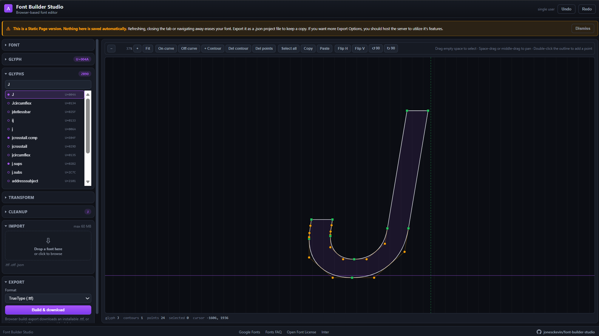

# Font Builder Studio

You can use the Static Version @ [fontstudio.stitchee.ca](https://fontstudio.stitchee.ca)


A browser-based font viewer/editor. Create, edit and convert fonts in the browser with an
interactive glyph-outline canvas editor. Built on **FontForge**'s Python bindings,
hosted as a single Docker container.

FileSupport|Type
-|-
|Import | SFD, SFDIR, TTF, OTF, TTC, WOFF, WOFF2, UFO/UFOZ/ZIP, PFB, PFA, SVG |
|Export | TTF, OTF, WOFF, WOFF2, SFD, SVG |



---

## Quick start

### Docker Build

```sh
git clone https://github.com/jonesckevin/font-builder-studio.git
cd font-builder-studio
docker compose up --build
```

### Docker Hub - Run
```sh
docker run -d --name font-builder-studio -p 9017:5000 \
  --read-only --tmpfs /tmp:size=256m,mode=1777 \
  --security-opt no-new-privileges:true --cap-drop ALL \
  jonesckevin/font-builder-studio:latest
```

Open <http://localhost:9017> for the editor.

---

## Data Management

### volume and logs

State lives in a **Docker-managed named volume** (`fbs-data`), so nothing is
written into the working tree. Docker initialises a new volume from the image,
which is what makes this work: the image pre-creates `/data` owned by `appuser`,
so the volume inherits uid 1000 and is writable without any `chown` step.

To keep the files somewhere you can open instead, comment the volume line in
`docker-compose.yml` and uncomment the bind mount beneath it:

```yaml
    volumes:
      # - fbs-data:/data
      - ${DATA_DIR:-./data}:/data
```

### Backup Data File via Docker
Find, inspect or back up the volume:

```sh
docker volume ls
docker run --rm -v font-builder-studio_fbs-data:/data -v "$PWD:/out" alpine \
  tar czf /out/fbs-backup.tgz -C /data .
```
